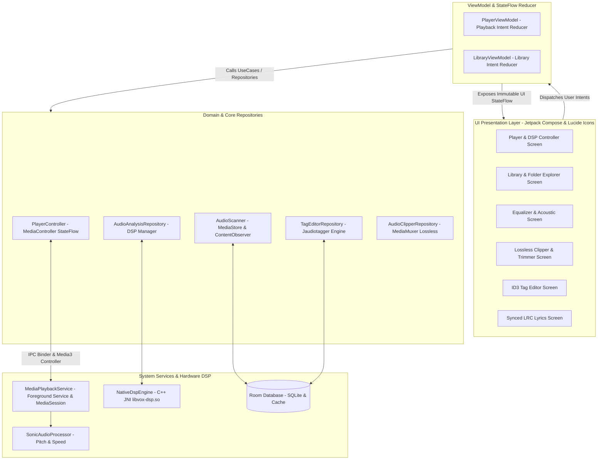

<div align="center">

# VOX

**Ultra-Minimalist Monochrome Offline Music Player & Audio Signal Processing Utility for Android**

[](https://android.com)
[](https://kotlinlang.org)
[](https://developer.android.com/jetpack/compose)
[](https://developer.android.com/media/media3)
[](https://developer.android.com/ndk)
[](LICENSE)

[**Download APK (v1.0.0)**](Vox_stable_v1.0.0.apk) • [**Fitur**](#-fitur-utama) • [**Spesifikasi Teknis**](#-spesifikasi-teknis) • [**Teknologi & Library**](#-teknologi--library) • [**Arsitektur & Flow**](#-arsitektur--data-flow) • [**Release Notes**](#-release-notes-v100)

</div>

---

## 📖 Deskripsi Aplikasi

**Vox** adalah aplikasi pemutar musik offline (*local audio player*) dan instrumen pemrosesan sinyal digital (*Digital Signal Processing* / DSP) berkinerja tinggi untuk platform Android. Dirancang untuk musisi, produser, audiophile, dan pendengar yang mendambakan pemutar musik tanpa distraksi, Vox menggabungkan mesin pemutaran audio profesional, ekstraksi sinyal audio native (BPM, Musical Key, Harmonic Chords), visual waveform trimmer, serta editor metadata ID3 terpadu.

### 🎨 Filosofi Desain (Ultra-Minimalist Monochrome)
* **Zero Container / Zero Card Elevation**: Tidak menggunakan card elevated, bayangan (*drop shadows*), gradasi warna mencolok, ataupun container berlapis yang membebani mata.
* **Pure Monochrome Spectrum**: Menggunakan warna fungsional AMOLED Black (`#000000`), Pure White (`#FFFFFF`), Neutral Gray (`#757575`), Hairline Dark Divider (`#222222`), dan Light Divider (`#E0E0E0`).
* **Typography-Driven & Mathematical Rhythm**: Hirarki visual dibangun menggunakan kontras bobot tipografi (*FontWeight*), spasi terukur (*8-Point Grid System*), dan *Hairline Dividers* (`0.5.dp`).
* **Sharp 1:1 Corners**: Cover art dan komponen grafis dirender dalam rasio 1:1 tajam (*zero corner radius*).
* **Lucide Vector Icons**: Seluruh set ikon antarmuka ditenagai oleh icon set presisi monokrom Lucide.

---

## ✨ Fitur Utama

### 1. Storage Scanner & Folder-Based Explorer
* **Folder Structure Navigation**: Pengelompokan berkas audio otomatis berdasarkan direktori penyimpanan fisik di internal storage maupun kartu SD (microSD).
* **Format Audio Universal**: Mendukung `.mp3`, `.flac`, `.wav`, `.m4a`, `.aac`, `.ogg`, dan `.opus`.
* **Real-time MediaStore Sync**: Dilengkapi `ContentObserver` untuk menyinkronkan daftar lagu secara otomatis saat berkas ditambah, dipindahkan, atau dihapus dari penyimpanan perangkat.

### 2. Core Playback Engine & Queue Management
* **Gapless Playback**: Pemutaran mulus tanpa jeda antar trek menggunakan mesin **Jetpack Media3 ExoPlayer**.
* **Smart Shuffle**: Algoritma True Random dengan *History Buffer* yang memastikan seluruh antrean diputar tanpa pengulangan trek yang sama sebelum selesai.
* **3-State Repeat Mode**: Beralih fleksibel antara *Loop All*, *Loop Current (Single Repeat)*, dan *No Loop*.
* **Precision Seekbar**: Scrubber linier ultra-tipis dengan tampilan waktu milidetik akurat.

### 3. DSP Engine: Speed & Pitch Shifter
* **Sonic Audio Processor**: Pengaturan kecepatan pemutaran (*Playback Speed*) dari `0.25x` hingga `3.00x` (step `0.05x`) dengan teknologi *Time Stretching* tanpa merusak pitch nada.
* **Independent Pitch Shifter**: Mengubah tangga nada audio dari `-12 semitone` hingga `+12 semitone` (step 1 semitone / 10 cents) secara terpisah dari kecepatan pemutaran lagu.
* **Quick Preset Chips**: Tombol pintas cepat untuk oktaf, normalisasi, dan kecepatan standar.

### 4. Graphic Equalizer & Acoustic Enhancer
* **Multi-band Equalizer**: Pengaturan frekuensi grafis dengan kontrol responsif berbasis Android `AudioEffect`.
* **Acoustic Modules**: Dilengkapi *Bass Boost*, *Spatial Virtualizer*, dan *Loudness Enhancer*.
* **Presets Engine**: Pilihan konfigurasi cepat (*Flat, Bass Boost, Vocal, Acoustic, Rock, Electronic, Treble, Custom*).

### 5. Precision A-B Looper
* Penandaan **Point A** dan **Point B** berpresisi milidetik untuk mengulang bagian tertentu dari lagu secara otomatis tanpa jeda (sangat ideal untuk latihan instrumen musik, transkripsi, atau belajar lirik).
* Visual marker terintegrasi langsung pada waveform scrubber.

### 6. NDK C++ Audio Signal Analysis (`libvox-dsp.so`)
* **BPM / Tempo Extraction**: Menghitung ketukan per menit (*Beats Per Minute*) secara otomatis menggunakan spectral onset detection dan autocorrelation filter di layer native C++.
* **Musical Key & Scale Detection**: Deteksi tangga nada dasar lagu (misal: *C Major, A Minor, F# Minor*) melalui ekstraksi 12-bin Pitch Chroma Profile.
* **Real-time Chord Progression Tracker**: Algoritma Harmonic Pitch Class Profiles (HPCP) berbasis windowed FFT untuk memetakan akor lagu (*Major, Minor, 7th, Diminished, Augmented*) dan divisualisasikan secara sinkron dengan posisi playback.
* **High-Performance Room DB Caching**: Hasil analisis sinyal disimpan di basis data lokal sehingga proses DSP berat hanya berjalan 1 kali per berkas.

### 7. ID3 Tag & Binary Metadata Editor
* **Tag Editing Lengkap**: Baca dan tulis field Title, Artist, Album, Album Artist, Genre, Year, Track Number, Disc Number, Composer, dan Comment.
* **Cover Art Embedding**: Ekstraksi dan penyematan cover art baru (JPEG/PNG) langsung ke dalam header biner file audio (.mp3, .flac, .m4a, .ogg) via mesin **Jaudiotagger**.
* **Scoped Storage Write Consent**: Alur kepatuhan `MediaStore.createWriteRequest` untuk Android 11+ (API 30+).

### 8. Fast Lossless Audio Clipper & Trimmer
* **Lossless Fast Trimming**: Pemotongan audio instan (< 1 detik) tanpa re-encoding menggunakan `MediaExtractor` dan `MediaMuxer` (stream-copy).
* **Custom Encoder**: Opsi ekspor ke format `.mp3`, `.wav`, atau `.m4a` dengan pilihan bitrate `128 kbps`, `192 kbps`, atau `320 kbps`.
* **Visual Waveform Preview**: Draggable range marker dengan preview playback khusus pada rentang klip.

### 9. Synced Lyrics Viewer (LRC Parser)
* **Dual Lyrics Reader**: Membaca berkas `.lrc` eksternal di folder lagu dan tag lirik tersemat (*Embedded USLT/SYLT*).
* **Real-time Lyrics Sync**: Sinkronisasi baris lirik aktif dengan *Smooth Auto-Scrolling* dan animasi transisi warna tipografi.
* **Seek-by-Lyric**: Lompat (*seek*) ke bagian lagu secara instan hanya dengan mengetuk baris lirik yang diinginkan.

### 10. Persistent Background Playback & Android Auto
* **Foreground Service**: Berjalan stabil di latar belakang dengan `MediaSessionService` dan integrasi notifikasi sistem `NotificationCompat.MediaStyle`.
* **Audio Focus & Headset Integration**: Pause otomatis saat panggilan masuk, audio ducking saat navigasi GPS, dan kontrol tombol headset Bluetooth.
* **Battery Whitelist Prompt**: Dialog izin pengabaian optimasi baterai OEM agar service audio tidak dimatikan paksa di latar belakang.

---

## 🛠️ Spesifikasi Teknis

| Parameter | Spesifikasi |
| :--- | :--- |
| **Target OS** | Android 10 (API 29) s/d Android 15 (API 35+) |
| **Minimum SDK** | API Level 29 (Android 10) |
| **Bahasa Pemrograman** | **Kotlin** 2.0.21 & **C++17** (NDK) |
| **Java Virtual Machine** | Java 21 / JVM Target 21 |
| **Build Tool** | Gradle 8.11.1 (Kotlin DSL `build.gradle.kts` + Version Catalog `libs.versions.toml`) |
| **Native Build System** | CMake 3.22.1 + Android NDK 27+ |
| **Pola Arsitektur** | Modern Clean Architecture + MVI (Model-View-Intent) + Unidirectional Data Flow |
| **Dependency Injection** | Dagger Hilt 2.52 |
| **Desain Antarmuka** | Jetpack Compose + Material 3 + Lucide Icons |
| **Ukuran APK Rilis** | ~56 MB (Termasuk Native C++ DSP Binaries untuk arm64-v8a, armeabi-v7a, x86_64) |

---

## 📦 Teknologi & Library

### Core & Framework
* **[Kotlin](https://kotlinlang.org/)**: Bahasa utama dengan Kotlin Coroutines & StateFlow untuk reactive state management.
* **[Jetpack Compose](https://developer.android.com/jetpack/compose)**: UI toolkit deklaratif Android modern.
* **[Dagger Hilt](https://dagger.dev/hilt/)**: Dependency Injection terstruktur untuk seluruh service, repository, dan ViewModel.

### Audio & Signal Processing
* **[Jetpack Media3 (ExoPlayer)](https://developer.android.com/media/media3)**: Audio playback engine, MediaSessionService, queue manager, dan buffer handler.
* **Sonic Audio Processor**: Time-stretch audio speed scaling dan pitch shifting.
* **Android NDK & C++ (`libvox-dsp.so`)**: Native DSP engine untuk AMediaExtractor PCM decoding, autocorrelation onset tracking, dan 12-bin HPCP chromagram.
* **Android `AudioEffect`**: Equalizer multi-band, Bass Boost, Virtualizer, dan Loudness Enhancer.

### Storage, Database & Metadata
* **[AndroidX Room](https://developer.android.com/training/data-storage/room)**: Basis data lokal SQLite dengan Room KSP Compiler untuk cache trek, folder, playlist, tag kustom, dan chord data.
* **[Jaudiotagger](http://www.jthink.net/jaudiotagger/)**: Engine manipulasi biner audio tags (ID3v1, ID3v2.3, ID3v2.4, Vorbis, MP4 atoms, USLT/SYLT, Cover Art).
* **Android MediaStore API & SAF**: Akses Scoped Storage dengan `createWriteRequest` dan `createDeleteRequest`.

### UI Assets & Utilities
* **[Lucide Icons for Compose](https://github.com/composables/icons-lucide-android)**: Kumpulan icon vector monokrom presisi.
* **[Coil Compose](https://coil-kt.github.io/coil/)**: Asynchronous image loader berkinerja tinggi dengan memory/disk cache untuk album artwork.

---

## 🏗️ Arsitektur & Data Flow

Vox mengimplementasikan arsitektur **Clean Architecture** dengan pola **MVI (Model-View-Intent)** yang menjamin pemisahan tanggung jawab (*separation of concerns*) dan aliran data satu arah (*Unidirectional Data Flow*):



---

## 🚀 Instalasi & Build dari Source

### 1. Download File APK Siap Pakai
Unduh berkas instalasi APK resmi yang telah dikompilasi langsung di root repositori:
* 📥 [**`Vox_stable_v1.0.0.apk`**](Vox_stable_v1.0.0.apk) (Versi rilis 1.0.0, arsitektur `arm64-v8a`, `armeabi-v7a`, `x86_64`).

### 2. Kompilasi Sendiri dari Source Code
Pastikan Anda telah menginstal **Android Studio Ladybug (2024.2+)**, **JDK 21**, dan **Android NDK (r27+)**.

```bash
# 1. Clone repositori
git clone git@github.com:imanecdoche/voxplayer.git
cd voxplayer

# 2. Periksa dependensi dan kompilasi debug
./gradlew compileDebugKotlin

# 3. Bangun paket APK Release
./gradlew assembleRelease

# 4. Berkas APK hasil build akan tersedia di:
# app/build/outputs/apk/release/app-release.apk
```

---

## 📋 Release Notes (v1.0.0)

### 🌟 Vox v1.0.0 — Official Stable Production Release
* **Ultra-Minimalist Monochrome UI**: Desain antarmuka flat berbasis tipografi murni, bebas container kartu elevated, dengan palet warna hitam AMOLED (`#000000`) dan putih (`#FFFFFF`).
* **Lucide Iconography**: Integrasi penuh icon set vektor Lucide untuk seluruh navigasi, kontrol player, scrubber looper, dan alat utilitas.
* **Jetpack Media3 & Background Engine**: Pemutaran audio offline gapless dengan background playback persisten dan MediaStyle notification.
* **Sonic Speed & Pitch Shifter**: Pengaturan kecepatan `0.25x` s/d `3.00x` dan pitch shifting `-12` s/d `+12` semitone independen secara real-time.
* **Multi-band Equalizer & Acoustic FX**: Equalizer grafis, bass boost, virtualizer, loudness enhancer, dan preset suara.
* **Precision A-B Looping**: Penandaan titik A dan B berpresisi milidetik dengan indikator visual langsung pada scrubber.
* **Native C++ DSP Engine (`libvox-dsp.so`)**:
  - Deteksi otomatis BPM (Beats Per Minute) berbasis onset energy autocorrelation.
  - Deteksi Tangga Nada Dasar (*Musical Key*) dengan 12-bin Pitch Chroma Profile.
  - Tracker progresi akor real-time (*HPCP Windowed Chromagram*) dengan visualizer sinkron.
* **ID3 Tag Editor & Binary Artwork**: Editor metadata ID3 lengkap dengan penyematan cover art JPEG/PNG dan kepatuhan Scoped Storage Android 11+.
* **Fast Lossless Audio Clipper**: Pemotongan audio tanpa proses re-encoding (< 1 detik) serta opsi kustom bitrate ekspor.
* **Synced LRC Lyrics**: Penampil lirik sinkron otomatis dengan fitur tap-to-seek playback.

---

<div align="center">
  <sub>Dikembangkan dengan presisi arsitektur Android Native modern oleh <b>imanecdoche</b>.</sub>
</div>
